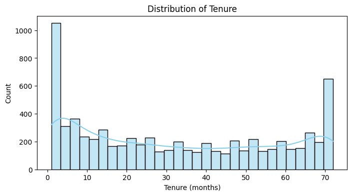
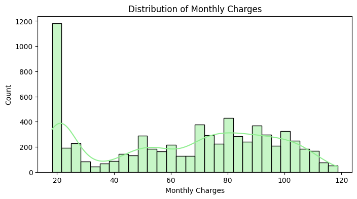

# Customer Churn Prediction

This project predicts customer churn for a telecom company using machine learning models, including Logistic Regression and XGBoost. The workflow covers data exploration, preprocessing, feature engineering, model training, evaluation, and model saving.


## Project Overview

Customer churn—the phenomenon where customers stop using a company’s service—is a critical challenge for subscription-based businesses, especially in the telecom sector. Retaining an existing customer is often significantly more cost-effective than acquiring a new one.

This project focuses on developing machine learning models to predict customer churn based on historical usage patterns and customer attributes. By identifying at-risk customers early, businesses can deploy targeted retention strategies such as discounts, personalized offers, or improved customer support.

Using a combination of XGBoost and Logistic Regression, along with techniques like SMOTE for handling class imbalance, we train and evaluate predictive models that can effectively distinguish between churners and non-churners.

---

## Data

- **Source:** `WA_Fn-UseC_-Telco-Customer-Churn.csv`
- **Description:** Contains customer demographics, account information, services signed up for, and churn status.
- **Target Variable:** `Churn` (1 = churned, 0 = stayed)




---

## Exploratory Data Analysis (EDA)

🔍 Exploratory Data Analysis (EDA)
A thorough Exploratory Data Analysis was performed to better understand the structure, quality, and patterns within the dataset. This helped guide preprocessing decisions and model development.

📌 1. Data Quality Checks

Checked for missing values, especially in TotalCharges (where empty strings were found and converted to NaN).

Verified data types, converting columns like TotalCharges from object to float.
Ensured consistent formatting of categorical variables for encoding.

📌2. Univariate Analysis

Plotted histograms and boxplots for key numerical features:
tenure: number of months a customer has stayed.
MonthlyCharges: current monthly bill.
TotalCharges: total revenue per customer.

Observed:
Customers with low tenure are more likely to churn.
Higher MonthlyCharges often correlate with churn.

📌3. Categorical Feature Analysis

Analyzed churn rates across various categorical features using bar plots and value counts:
Contract type: Month-to-month contracts had the highest churn rates.
SeniorCitizen and gender: Minimal difference in churn rates.
InternetService, TechSupport, and PaymentMethod showed notable churn patterns.

🔗 4. Correlation Analysis
Created a correlation heatmap to explore relationships between numeric features.

Found moderate correlation between:
tenure and TotalCharges
MonthlyCharges and TotalCharges
Used this to identify multicollinearity and guide feature selection.

---

## Feature Engineering

- Converted categorical variables to numerical (label encoding, one-hot encoding).
- Created new features:
    - `IsLongTerm`: Customers with tenure >= 12 months.
    - `NumServices`: Total number of services subscribed.
    - `HighRiskPaymentMethod`: Flag for electronic check payment.
    - `SeniorAlone`: Senior citizens living alone.
- Handled missing values and standardized numerical features.

---

## Modeling

- **Logistic Regression:**  
    - Trained on both all features and top 15 features (by absolute coefficient).
    - Used SMOTE to address class imbalance.
    - Performed threshold tuning for optimal precision/recall trade-off.
- **XGBoost:**  
    - Trained on SMOTE-balanced data.
    - Hyperparameter tuning with GridSearchCV.
    - Feature importance analysis and top 15 features model.
    - Threshold tuning for business-driven evaluation.

---

## Evaluation

- Metrics: Accuracy, Precision, Recall, F1-score, ROC AUC, Confusion Matrix.
- Compared models at different probability thresholds to show trade-offs.
- Visualized feature importances and model performance.

### Threshold Tuning and Business Impact

To optimize model performance for business needs, we experimented with different probability thresholds for classifying churners:

- **Lower thresholds** :  
  - **Benefit:** Catches nearly all churners (high recall), minimizing the risk of missing at-risk customers.
  - **Trade-off:** Increases false positives—some loyal customers may be flagged as churn risks, potentially leading to unnecessary retention offers.

- **Higher thresholds** :  
  - **Benefit:** Reduces false positives, so retention efforts are more targeted and cost-effective.
  - **Trade-off:** Some actual churners may not be flagged (lower recall), risking lost customers.


**Business Implications:**  
- For aggressive retention (catch all churners): use a lower threshold.
- For cost-effective targeting: use a higher threshold.
- The optimal threshold depends on the company’s priorities—whether minimizing churn or optimizing retention costs.


## Results

- **Best XGBoost model:**  
    - Achieved high recall for churners with reasonable precision and accuracy.
    - Top features included tenure, contract type, and payment method.
- **Best Logistic Regression model:**  
    - Provided interpretable coefficients and competitive performance.
    - Threshold tuning allowed for business-driven trade-offs.

| **Model**                | **Accuracy** | **Precision** | **Recall** | **F1 Score** | **Macro Avg F1** |
| -------------------------| ------------ | --------------| ---------- | -------------| ---------------- |
| **XGBoost**              | 0.79         | 0.58          | 0.70       | 0.63         | 0.74             |
| **Logistic Regression**  | 0.76         | 0.53          | 0.76       | 0.62         | 0.72             |


## Requirements

- Python 3.8+
- pandas
- numpy
- scikit-learn
- xgboost
- imbalanced-learn
- seaborn
- matplotlib
- joblib

Install all dependencies with:
```bash
pip install -r requirements.txt
```

---

## Project Structure

```
customer-churn-prediction/
│
├── Data/
│   └── WA_Fn-UseC_-Telco-Customer-Churn.csv
│   └── processed_data.csv
├── notebooks/
│   ├── EDA.ipynb
│   ├── logisticregression.ipynb
│   └── Xgboost.ipynb
├── models/
│   ├── logistic_regression_model_full.pkl
│   ├── logistic_regression_model_top15.pkl
│   ├── xgboost_model_full.pkl
│   └── xgboost_model_top15.pkl
├── requirements.txt
└── README.md
```

---

## Acknowledgements

- [IBM Sample Data](https://www.ibm.com/communities/analytics/watson-analytics-blog/guide-to-sample-datasets/)
- [XGBoost Documentation](https://xgboost.readthedocs.io/)
- [scikit-learn Documentation](https://scikit-learn.org/)

---

*For questions or contributions, please open an issue or pull request!*